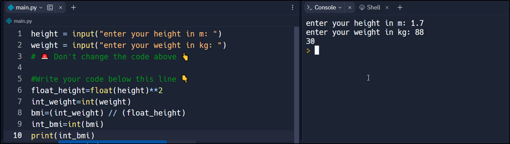

# Day 2 Challenge:
This is a second day of 100 days challenge, today we have used different datatypes and learn how to manipulate data types and designed some fun programs.

##  weight watcher- BMI:

## Whats my remaining age?:

 ## Tip calculator:

## Data type manipulation:

 