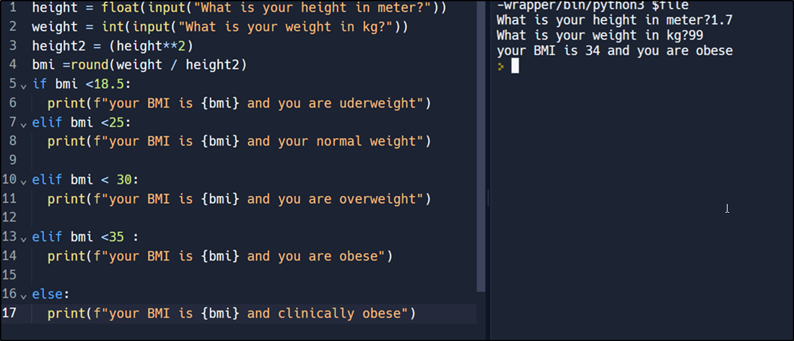
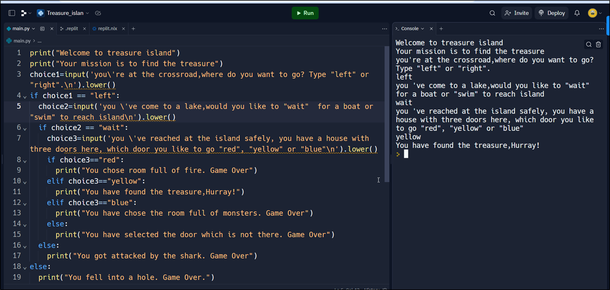
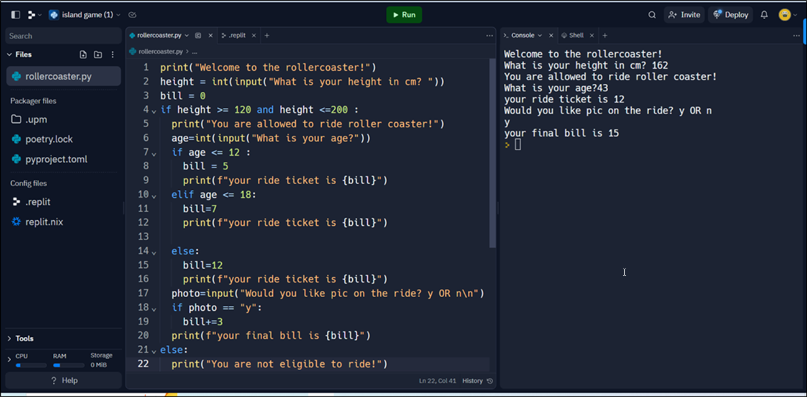
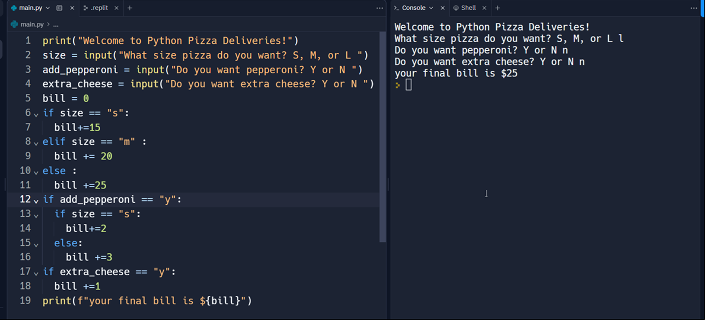
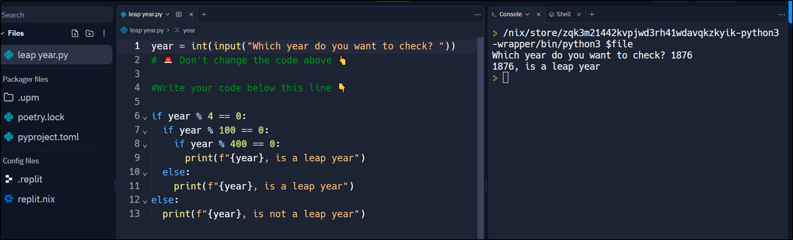
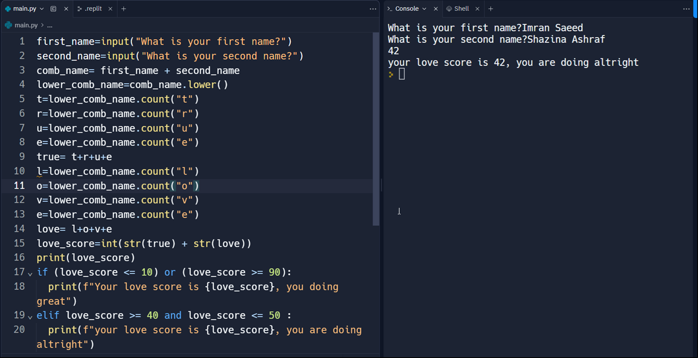
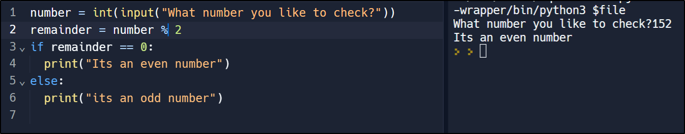

# Day 2 Challenge:
This is a third day of 100 days challenge, today we have learned "if" and "elif" statement. We have also used nested if statement and different operations.

##  weight watcher- Updated BMI:

## Love Adventure- Treasure Island:

## Time for a Roller coaster!:

## Love Pizza?

## leap year or not?

## Love compatibility test :

## EVEN or ODD?

