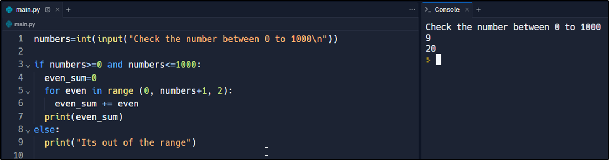
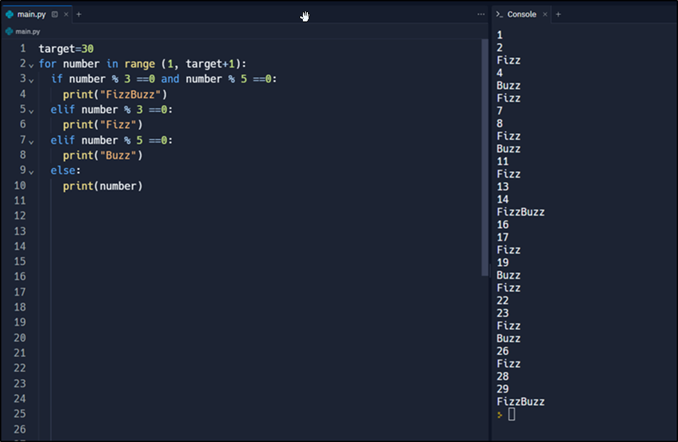
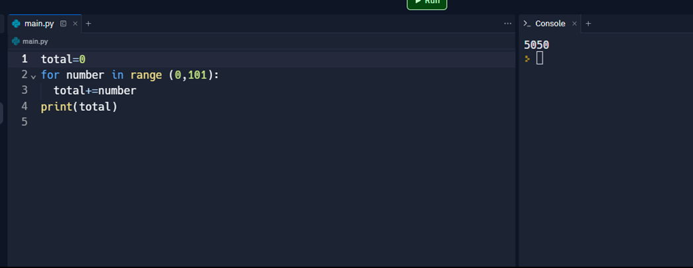
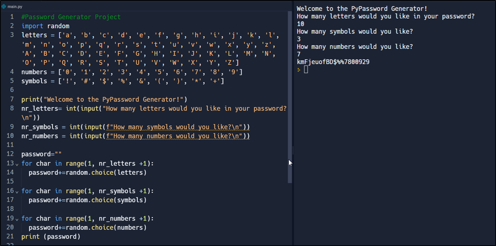
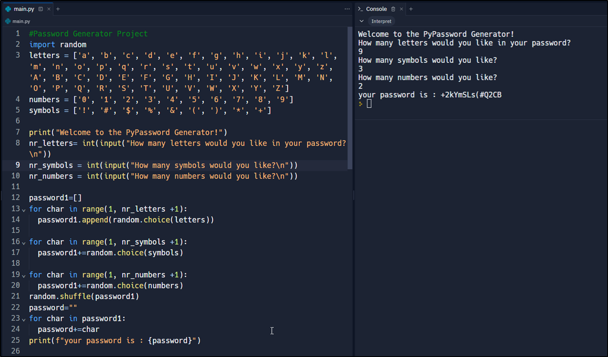

# Day 5 Challenge:

Today is a fifth day of 100 days challenge, today we have learned how to use for loop and create programs with for loop and other functions.

## Even number calculator:

## Fizz Buzz Game:

## Addition in loop :

## Password Generator (Easy Mode):

## Password Generator (Hard Mode):

